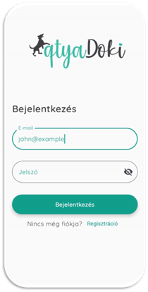
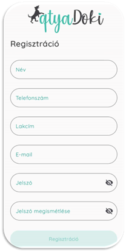
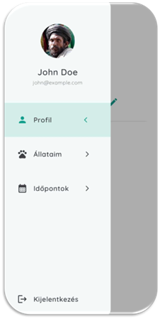
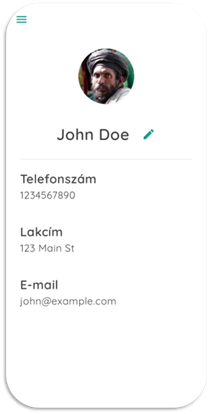
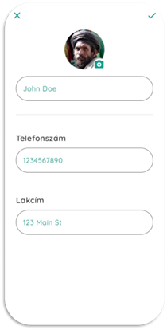
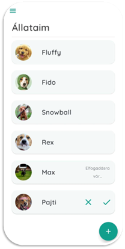
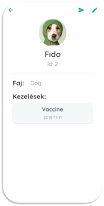
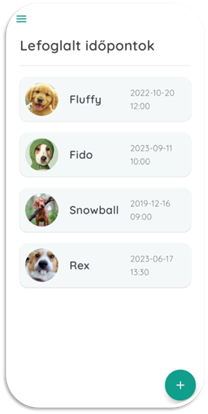
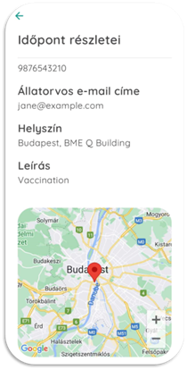

## Bevezetés

A **QtyaDoki** egy olyan egyedülálló alkalmazás, amely megkönnyíti egyaránt az állatorvosok és az állattartók mindennapjait. Az alkalmazás létrejöttét az egészségügyben használatos EESZT (Elektronikus Egészségügyi Szolgáltatási Tér) applikáció inspirálta, amelyet az állatok világába szeretnénk átemelni.

Az állatorvosok és az állattartók egyaránt megtalálják ebben az alkalmazásban a mindennapi feladataik egyszerűsítéséhez és hatékonyabbá tételéhez szükséges eszközöket.

A QtyaDoki lehetővé teszi az állatorvosok számára, hogy gyorsan és könnyedén rögzítsék az állatok adatait, különböző gyógyszeres kezeléseket, oltásokat rendeljenek az állatokhoz. Az alkalmazásban szereplő részletes egészségügyi profilok segítik az állatorvosokat a gyorsabb diagnózisban.

Az állattartók számára pedig a QtyaDoki lehetőséget nyújt az állataik egészségi állapotának nyomon követésére és gondozására. Az alkalmazás segít az oltások és gyógyszerek időzített beadásának emlékeztetésében. Ezenkívül a QtyaDoki lehetővé teszi az állattartók számára, hogy egyszerűen időpontot foglaljanak az általuk preferált állatorvosi rendelőbe.

## Android

Az alkalmazás elkészítéséhez **Jetpack Compose**-t használtam, követve az **MVVM** struktúra által szabott elvárásokat.

Az alkalmazás indításakor a bejelentkezés oldalon találjuk magunkat, ahol lehetőségünk van bejelentkezni az adataink megadásával, valamint amennyiben nem rendelkezünk fiókkal, átléphetünk a regisztrációs oldalra, ahol létrehozhatunk egy új felhasználót. Érdekességként hozzáadtam egy farokcsóválás animációt az itt látható logókhoz.

 

A sikeres bejelentkezést követően láthatóvá válik a Drawer menü, ahol lehetőségünk van navigálni a különböző oldalak között, valamint itt látható a bejelentkezett felhasználó profilképe, neve és email címe is.

A profil oldalon láthatjuk a felhasználó adatait, valamint a módosítást jelző ikonra kattintva lehetőségünk van módosítani is azok egy részét. A profilkép módosításakor két lehetőség közül választhatunk: tallózunk egy már meglévő képet a galériából, vagy készítünk egy új képet.

 

Az *Állataim* oldalon látható az állatokat tartalmazó lista. A lista egy *LazyColumn*, emellett görgethető, valamint frissíthető is. Azon állatok, amelyek átadását kezdeményeztünk, azonban még nem kerültek elfogadásra, *"Elfogadásra vár"* felirattal vannak ellátva. Ha egy másik felhasználó szeretne átadni nekünk állatot, akkor ezek is megjelennek a listában, valamint ezeknél láthatunk két gombot, amelyekkel elutasíthatjuk, vagy elfogadhatjuk az állatot. 

 

Az időpontok oldalon egy listát láthatunk a felhasználó által foglalt időpontokról. A lista, akárcsak az állatoknál, itt is frissíthető. Új időpontot a hozzáadás gombra kattintva tudunk foglalni, ilyenkor megjelenik egy felugró ablak, ahol kiválaszthatjuk az állatot, az állatorvost, a dátumot, valamint tovább lépve a szabad időpontok listájából választhatunk.

 